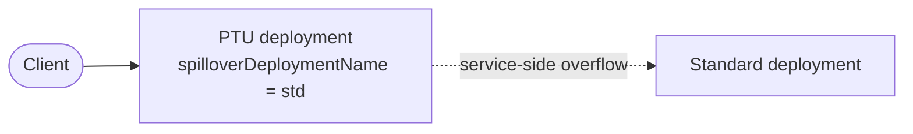
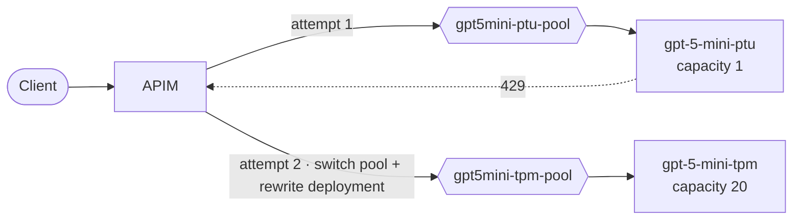
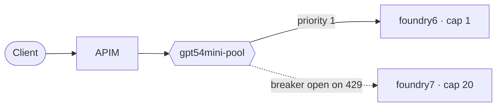

# Part 2 — PTU → TPM failover options

The ways a PTU (Provisioned Throughput Unit) primary can spill over to a TPM (Standard / PayGo, token-per-minute) secondary that are worth actually considering, and which ones are worth demonstrating in this lab.

> Status: working document. Scenarios 2 and 3 are implemented in [policy.xml](labs/model-routing/policy.xml) / [main.bicep](labs/model-routing/main.bicep); the rest are candidates. Behavioral claims about APIM and Foundry were checked against Microsoft Learn on 2026-09-17 and are linked inline.
>
> The catalogue is curated, not exhaustive. Patterns that address a *different* problem — gateway HA via Front Door, weighted blue/green pools — are deliberately excluded or demoted to [§5](#5-cross-cutting-concerns) so that every numbered scenario is a genuine alternative to the others.

---

## 1. Why failover is needed at all

A provisioned deployment has a **fixed** throughput ceiling. When concurrent load pushes utilization past 100 %, Azure OpenAI / Foundry rejects the call:

| Signal | PTU (Provisioned*) | TPM (Standard / Global Standard) |
|---|---|---|
| Throttle status | `429 Too Many Requests` | `429 Too Many Requests` |
| Retry hint header | `retry-after-ms` (sub-second to low seconds) | `Retry-After` (seconds) |
| Cause | `provisioned-managed utilization` at capacity | tokens-per-minute / requests-per-minute quota |
| Cost model | Fixed — hourly PTU rate, or prepaid via a **reservation** (see [Appendix B](#appendix-b--how-reservations-factor-into-the-cost)) | Per-token, metered |

The whole point of spillover: **keep the cheap, predictable PTU saturated, and only overflow the excess to pay-as-you-go.** Failing over too eagerly wastes the PTU you already paid for.

\* Three provisioned SKUs exist, differing only in **where inference is allowed to run** — all three throttle identically, so every pattern below applies unchanged to each:
>
> | SKU | Scope |
> |---|---|
> | `ProvisionedManaged` | **Regional** — one Azure region |
> | `DataZoneProvisionedManaged` | **Data zone** — e.g. US or EU |
> | `GlobalProvisionedManaged` | **Global** — any region with capacity |
>
> See [Appendix A](#appendix-a--ptu-sku-scopes-compared) for the full comparison and what it means for choosing a spillover target.

---

## 2. The design space

Every option is a point in this space:

| Dimension | Choices |
|---|---|
| **Where the decision is made** | Client SDK · APIM policy · APIM backend pool · Foundry platform (native spillover) · DNS/traffic layer |
| **Topology** | Two deployments on one resource · Two resources same region · Two resources cross-region · Cross-subscription/tenant |
| **Failover granularity** | Same request retried · Subsequent requests rerouted (circuit breaker) · Percentage split (weighted) |
| **Trigger** | HTTP 429 only · 429 + 5xx · timeout · utilization metric · token-budget exhaustion |
| **State** | Stateless per request · Stateful (breaker open for a TTL) |
| **Streaming safe?** | Yes (pre-first-byte only) · No (cannot retry mid-stream) |

---

## 3. Scenario catalogue

### Scenario 1 — Platform-native provisioned **spillover** (no gateway involved)

Foundry can route a provisioned deployment's overage to a standard deployment itself. Client and gateway keep using one deployment name. See [Manage traffic with spillover for provisioned deployments](https://learn.microsoft.com/azure/foundry/openai/how-to/spillover-traffic-management).



- **Enable it** one of two ways: set the deployment property `spilloverDeploymentName`, or set the per-request header `x-ms-spillover-deployment`. If both are present, the deployment property wins.
- **Trigger:** any non-200 from the provisioned deployment — `429`, `500`, or `503`.
- **Prerequisites are strict:** a **global or data zone provisioned** primary, a **global or data zone standard** spillover target, both in the **same** Foundry/Azure OpenAI resource, with matching data-processing level. Regional `ProvisionedManaged` is not listed as eligible.
- **Observability is good, not poor:** spilled responses carry `x-ms-spillover-from-deployment` (the PTU name), `x-ms-deployment-name` (who actually served it), and `x-ms-spillover-error` (the originating status code). In Azure Monitor, split `Azure OpenAI Requests` by `ModelDeploymentName`, `StatusCode`, and `IsSpillover`.
- **Cost:** provisioned-served requests incur only the hourly PTU cost; spilled requests are billed at standard per-token rates.
- **Cons:** same-resource only, so no cross-region or cross-resource control, and no gateway-level governance of the split. Availability varies by model/region and some pages still carry a Preview banner — verify before demoing.
- **Lab value:** high — it is the "you may not need the gateway for this" counterpoint. This lab has no PTU, so it cannot be demonstrated here without buying provisioned capacity.

> **Why this one is listed first.** It is the cheapest correct answer when you qualify for it: no policy, no extra backend, no breaker to tune, and the same request is saved. Reach for a gateway pattern (Scenarios 2 and 3) only when a prerequisite rules this out — a regional `ProvisionedManaged` primary, a spillover target on a different resource or region, or a need for gateway-level governance of the split.

### Scenario 2 — Policy retry across two single-member pools, two deployments on ONE Foundry resource ✅ implemented

`gpt-5-mini-ptu` → `gpt-5-mini-tpm` on the same `foundry2` endpoint, each fronted by its own backend pool
(`gpt5mini-ptu-pool` → `gpt5mini-tpm-pool`), switched by an explicit `<retry>`. **No circuit breaker.**



- **Decision point:** `<retry>` inside `<backend>`, doing two things per attempt — `set-backend-service` to the
  attempt's pool, *and* rewriting the URL path plus the body `model` field.
- **Granularity:** the *same* request fails over — zero user-visible failures.
- **Why there is no circuit breaker:** the retry names its target explicitly, so breaker state is never consulted.
  A breaker would actively hurt here: each pool has exactly one member, so a tripped member leaves the pool with
  nothing to route to, and the `PT1M` open window would keep rejecting a PTU you are paying for by the hour.
- **The pools are semantic, not functional.** Both pools resolve to the *same* `foundry2` host, because deployments
  are resource-scoped while APIM backends are host-scoped — see
  [Part 1a1-DeploymentIsResourceScoped.md](Part%201a1-DeploymentIsResourceScoped.md). The `rewrite-uri` + body
  rewrite is what actually performs the failover. What the pools buy you is a named PTU path and a named TPM path
  that show up in APIM metrics/traces as distinct backends, and a seam to later add a real second resource to
  either pool without touching the policy. Do not mistake the pool switch for the mechanism.
- **Observability:** the outbound section stamps `x-served-deployment`, `x-served-pool` and `x-served-attempts`
  on the response, so a demo can prove which side served the call.
- **Pros:** cheapest topology (one resource, one quota footprint), no extra region, deterministic, no breaker TTL
  to tune.
- **Cons:** custom policy to maintain; body buffering required (`buffer-request-body="true"`); the pool layer adds
  indirection that does no routing work today; does not help if the whole resource/region is down.

> A single-member pool and two pools referencing the same backend are both legal in APIM — `pool.services` has no
> minimum length and membership is just a reference list.

### Scenario 3 — Native backend pool + circuit breaker, two resources ✅ implemented

`gpt-5.4-mini` on `foundry6` (priority 1) and `foundry7` (priority 2), grouped in `gpt54mini-pool`.



- **Decision point:** APIM backend pool (`type: Pool`, per-member `priority`) + per-backend `circuitBreaker` tripping on one 429 within `PT1M`, open for `PT1M`, `acceptRetryAfter: true`.
- **Granularity:** *subsequent* requests only. Microsoft documents that lower-priority groups are used "when all backends in higher priority groups are unavailable because circuit breaker rules are tripped" — so the 429 that trips the breaker is returned to the caller. There is no automatic same-request failover.
- **Pros:** declarative, no custom policy, covers resource/region outage too.
- **Cons:** needs two resources (two quota allocations); one request is sacrificed on every trip *and* on every reset probe; breaker TTL is a blunt instrument — a 1-minute open breaker can starve a PTU you're paying for.
- **Selection modes available:** round-robin, weighted, priority-based. No latency-aware routing and no active health probes — a tripped breaker is the only "unhealthy" signal.

> On a **standalone** backend (not in a pool), an open breaker makes APIM return `503 Service Unavailable` rather than the backend's own 429. Inside a pool the request falls through to the next priority group instead.

> **On weights.** The same pool also accepts `weight` instead of (or inside) priority groups — a 90/10 split, say. That is the right tool for blue/green rollout, but it is the *wrong* tool for PTU spillover: a static weight sends paid-for PTU capacity to PayGo before the PTU is saturated, and it guesses at a ratio that Scenarios 4 and 5 derive from an actual signal. Use weights to shift traffic between versions, not to overflow a PTU.

### Scenario 3b — Pool + retry, to also recover the triggering request

Same pool as Scenario 3, plus a `<retry>` on 429. Microsoft's documented ["switch backend when error received"](https://learn.microsoft.com/azure/api-management/retry-policy#examples) pattern names the target explicitly on each attempt:

```xml
<backend>
  <retry condition="@(context.Response != null && context.Response.StatusCode == 429)"
         count="1" interval="1" first-fast-retry="true">
    <set-variable name="attempt" value="@(context.Variables.GetValueOrDefault<int>("attempt", 0) + 1)" />
    <set-backend-service backend-id="@((int)context.Variables["attempt"] < 2 ? "foundry6" : "foundry7")" />
    <forward-request buffer-request-body="true" />
  </retry>
</backend>
```

- `count` is the number of **retries** — total attempts = `count + 1`.
- `interval` is a required attribute documented as a positive number of seconds; `first-fast-retry="true"` is what makes the first retry immediate.
- Re-forwarding to the **pool** with a bare `<forward-request />` and expecting a different member is **not documented**. It may work because the tripped backend is unavailable, but name the backends explicitly unless you have traced otherwise.

**Recommended production shape.** Deliberately *not* implemented in this lab — [README.md](README.md) explains that omitting it keeps the 429 visible and preserves the contrast with Scenario 2.

### Scenario 4 — Token-budget-driven routing (proactive, not reactive)

Put `azure-openai-token-limit` / `llm-token-limit` on the PTU path and divert to TPM **while budget still remains**, before the backend ever throttles.

```xml
<llm-token-limit counter-key="@(context.Subscription.Id)"
    tokens-per-minute="50000" estimate-prompt-tokens="true"
    remaining-tokens-variable-name="remainingTokens" />
<choose>
  <when condition="@(context.Variables.GetValueOrDefault<long>("remainingTokens", long.MaxValue) < 5000)">
    <set-backend-service backend-id="tpm-backend" />
  </when>
  <otherwise><set-backend-service backend-id="ptu-backend" /></otherwise>
</choose>
```

- **The threshold must be above zero.** This policy is a *limiter*, not a router: once `tokens-per-minute` is exceeded it returns `429` itself (or `403` when a `token-quota` is exhausted) and the `<choose>` never executes. Divert on a low-water mark so you leave the PTU path before that happens.
- **Pros:** no 429 reaches the client; per-tenant fairness; clean cost attribution.
- **Cons:** the gateway's token estimate is an approximation of the PTU's real utilization, and the counter is tracked **per gateway** — it is not aggregated across regional or workspace gateways. Use a 429 retry as a backstop.

### Scenario 5 — Utilization-metric-driven routing

Read the **Provisioned-managed utilization V2** metric (emitted per provisioned deployment) and flip traffic when it crosses a threshold (e.g. 90 %).

- **Implementation:** out-of-band — an alert/automation updates an APIM named value or backend pool weights; the policy reads the named value.
- **Pros:** proactive, and it uses the authoritative signal rather than a gateway-side estimate.
- **Cons:** metric latency, moving parts (alert → automation → APIM control plane), overkill for a demo but a solid architecture talking point.
- **Match it to the right timescale.** The alert → automation → control-plane loop takes minutes; a PTU saturates in seconds. Use this to shift a *sustained* capacity imbalance, not to absorb bursts — pair it with Scenario 2 or 3b as the fast-path backstop, or you will build it and find the 429s still arrive.

### Scenario 6 — Model-substitution fallback (degrade, don't fail)

On sustained 429 for `gpt-5.4-mini`, fall back to a *different, cheaper* model (`gpt-5-nano`) rather than the same model on PayGo.

- **Pros:** protects availability and cost when the whole model family is constrained.
- **Cons:** the output-quality change must be acceptable and surfaced to the caller (e.g. an `x-served-model` response header).

### Scenario 7 — Queue / shed instead of spilling

Return `429` with `Retry-After` to the client, or enqueue to a batch deployment, when the workload is latency-tolerant.

- **Pros:** strictly cheapest; PTU stays the only paid path.
- **Cons:** needs a client that respects backpressure.

> This is the only entry that questions the premise. For batch, overnight, or best-effort workloads, *not* spilling is usually the correct answer — spillover exists to protect interactive latency, and paying PayGo rates for work nobody is waiting on is pure waste. Decide whether the workload is actually latency-sensitive before choosing any of the patterns above.

---

## 4. Comparison matrix

| # | Option | Where | Saves the triggering request | Cross-resource | Cross-region | Extra cost | Policy complexity |
|---|---|---|---|---|---|---|---|
| 1 | Native provisioned spillover | Foundry | ✅ | ❌ (same resource) | ❌ | none | none |
| 2 | Policy retry across 2 single-member pools, 2 deployments / 1 resource | APIM policy (+ pools, cosmetic) | ✅ | ❌ | ❌ | none | medium |
| 3 | Priority pool + circuit breaker | APIM pool | ❌ | ✅ | ✅ | 2nd resource | none |
| 3b | Pool + breaker + explicit retry | APIM pool+policy | ✅ | ✅ | ✅ | 2nd resource | low |
| 4 | Token-budget routing | APIM policy | ✅ (pre-empts) | ✅ | ✅ | none | medium |
| 5 | Utilization-metric routing | External + APIM | ✅ (pre-empts) | ✅ | ✅ | automation | high |
| 6 | Model substitution | APIM policy | ✅ | ✅ | ✅ | none | low |
| 7 | Shed / queue | APIM policy | ❌ | n/a | n/a | none | low |

Scenarios 1–3b are *mechanisms* — pick one. Scenarios 4 and 5 are *pre-emptive* and layer on top of a mechanism. Scenarios 6 and 7 are different answers to "capacity ran out" rather than spillover at all, and they are listed because they are often the cheaper decision.

---

## 5. Cross-cutting concerns

### Cross-region spillover and data residency
Any of Scenarios 2, 3 or 3b can place the secondary in a different region — PTU in region A, TPM in region B, or a Global Standard deployment as the overflow. This is a *topology* choice applied to a mechanism, not a mechanism of its own.

- **Pros:** survives regional capacity crunches and outages; Global Standard is the most elastic overflow target.
- **Cons:** data residency / compliance implications; added latency; per-region model-version drift can change outputs.
- **Match the spillover scope to the PTU scope.** A regional `ProvisionedManaged` PTU was almost certainly chosen *for* its residency guarantee — spilling it to Global Standard silently discards that guarantee. Pair like with like: Regional → `Standard`, Data zone → `DataZoneStandard`, Global → `GlobalStandard`. See [Appendix A](#appendix-a--ptu-sku-scopes-compared).

### Reducing how often any of this triggers
Spillover is a response to demand you could have avoided. `llm-semantic-cache-lookup` / `-store` in front of everything means cache hits consume neither PTU nor TPM, which lowers the rate at which you hit the ceiling at all.

It is not a failover mechanism and does not belong in the comparison above, but it changes the economics of every row in it. One caveat worth stating plainly: semantic caching matches on *similarity*, so a near-miss can return an answer to a subtly different question. Tune the similarity threshold conservatively and keep it away from request paths where a wrong-but-plausible answer is costly.

### What this replaces: client-side / SDK failover
Most teams arrive holding two clients in the app (PTU endpoint, TPM endpoint), catching 429 themselves. It works, and it gives full control of streaming retry semantics with no gateway dependency.

It is listed here rather than in the catalogue because it is the status quo the gateway patterns displace, not a design you would newly choose: the logic is duplicated in every app and language, there is no central governance, metering or policy, and credentials for both endpoints spread everywhere. If you already run APIM, moving this logic into the gateway is the point.

> **Also out of scope:** putting Front Door in front of two APIM instances (or a Premium multi-region APIM) addresses *gateway* failure, not model throttling. It is a real pattern, but it answers a different question and is deliberately not part of this catalogue.

### Streaming (`stream: true`)
A 429 arrives before any response body, so pre-first-byte failover (Scenarios 1, 2, 3b) is safe. Once the first SSE chunk has been written to the client, no retry is possible and a mid-stream backend failure is unrecoverable.

### Honouring `retry-after-ms`
PTU 429s typically carry `retry-after-ms` with a short back-off. Note that APIM's `<retry>` requires `interval` to be a **positive** number of seconds, so you cannot express a sub-second wait with it — `first-fast-retry="true"` is the supported way to retry immediately. That is correct when the retry targets a *different* deployment, and wrong if it re-hits the same one, which just amplifies load. The circuit breaker's `acceptRetryAfter: true` honours the header, but a `<retry>` does not inherit that.

### Retry storms and idempotency
Cap attempts — `count` is the number of *retries*, so `count="1"` means two attempts total. Never retry the same saturated backend without backoff. Chat completions are effectively idempotent; anything with tool side effects is not.

### Breaker TTL tuning
`PT1M` open breaker on a PTU you pay for hourly = up to a minute of wasted reserved capacity per trip. Shorter TTLs (`PT10S`) keep PTU utilization high at the cost of more 429 probes. If the PTU is under a **reservation**, that wasted minute is money already spent — see [Appendix B](#appendix-b--how-reservations-factor-into-the-cost).

### Cost attribution
Emit which tier served the request so PayGo overflow is measurable:

```xml
<azure-openai-emit-token-metric namespace="model-routing">
  <dimension name="Tier" value="@((string)context.Variables.GetValueOrDefault("servedTier","unknown"))" />
</azure-openai-emit-token-metric>
```

### Observability checklist
- `x-ms-region` → the **region** that served the request. It cannot separate two backends in the same region — in this lab foundry6 and foundry7 are both East US 2, so a custom header is required to see the spillover.
- Custom `x-served-backend` / `x-served-tier` header set in `<outbound>`.
- APIM `Backend Response Code` + `Backend URL` in App Insights.
- **Provisioned-managed utilization V2** metric for PTU headroom.
- For native spillover (Scenario 1): the `x-ms-spillover-from-deployment` / `x-ms-deployment-name` / `x-ms-spillover-error` response headers, and the `IsSpillover` split on `Azure OpenAI Requests`.
- Count of 429s *after* failover (should be ~0) vs. before (expected).

### Quota and capacity
The spillover deployment needs its own TPM quota in the target region. A failover path that 429s because the *secondary* has no quota is worse than none — validate with a capacity check before the demo.

---

## 6. Recommended lab additions (priority order)

1. **`x-served-backend` outbound header** — prerequisite for the rest. Without it, Scenario 3's spillover is invisible, because both pool members report the same `x-ms-region`.
2. **Scenario 6** — model substitution, reusing the existing `gpt-5-nano` deployment. Nearly free to add.
3. **Scenario 4** — token-limit pre-emptive routing. Shows proactive vs. reactive.
4. **Semantic cache** — see [Reducing how often any of this triggers](#reducing-how-often-any-of-this-triggers), if a Redis dependency is acceptable.

Not planned: **Scenario 3b** is documented in [README.md](README.md) but intentionally left out of the policy so the 429 stays observable. **Scenario 1** cannot be demonstrated without real provisioned capacity.

---

## 7. Open questions

- Should the Scenario 3 breaker trip on `5xx` as well as `429`, and what does that do to the demo's determinism?
- What does a capacity-1 `GlobalStandard` 429 look like compared to a genuine provisioned-utilization 429 — enough difference to matter when narrating the demo?
- Would a shorter `tripDuration` (`PT10S`) make the spillover easier to demo without making it flaky?

Resolved:

- ~~Is native spillover configurable?~~ Yes — `spilloverDeploymentName` on the deployment, or the `x-ms-spillover-deployment` request header. Requires a global/data-zone provisioned primary and a matching standard target **in the same resource**.
- ~~What does `x-ms-region` show when both pool members are in one region?~~ The same value. A custom `x-served-backend` header is required.

---

## Appendix A — PTU SKU scopes compared

The only real difference between the three provisioned SKUs is **where the request is allowed to be processed**. Everything downstream of that — throttling behavior, failover mechanics — is identical.

| | `ProvisionedManaged`<br/>**Regional** | `DataZoneProvisionedManaged`<br/>**Data zone** | `GlobalProvisionedManaged`<br/>**Global** |
|---|---|---|---|
| Where the request is processed | Only in the deployment's own Azure region | Any region inside the data zone (US or EU) | Routed across Azure regions globally |
| Data **at rest** | Resource's geography | Resource's geography | Resource's geography |
| Data **in processing** | Stays in-region | Stays in-zone | May leave the geography |
| Microsoft's "best for" | Strict single-region data residency | Zone-level residency with higher availability than regional | Highest availability, when the routing region isn't constrained |
| Natural TPM spillover partner | `Standard` (same region) | `DataZoneStandard` | `GlobalStandard` |
| Eligible for **native** spillover (Scenario 1) | Not listed as supported | Yes | Yes |

> Capacity availability, PTU minimums, price per PTU, and time-to-new-models do generally move in the order Regional → Data zone → Global, but the actual numbers are model-, region-, and pricing-dependent. Check current quota and pricing rather than relying on a fixed ranking.

### Identical across all three

- Throttle status `429 Too Many Requests`.
- Cause reported as provisioned-managed utilization at capacity.
- The **Provisioned-managed utilization V2** metric.
- Every gateway-side failover pattern in the catalogue above — the SKU never changes the mechanism. (Native spillover, Scenario 1, is the exception: it has SKU prerequisites.)

### What the scope *does* change

1. **Your exposure to a regional capacity crunch.** Global draws on a much larger pool, so it is less likely to be blocked at *deployment* time or affected by one region's constraints; regional is the most exposed (the main argument for a [cross-region secondary](#cross-region-spillover-and-data-residency)). Neither changes how your own PTU ceiling saturates at runtime.
2. **What your spillover target may legally be.** A regional PTU usually exists *because* someone required in-region processing — a cross-region secondary is off the table for that workload unless the secondary is in the same region.
3. **Whether Scenario 1 is even available.** Native spillover requires a global or data zone provisioned deployment; a regional PTU has to fail over at the gateway.

> **Lab note:** this lab has no real PTU. Primaries use `GlobalStandard` with capacity `1` to force fast, deterministic 429s. The failover *mechanics* are identical to a genuine PTU; only the 429's underlying cause differs (TPM quota vs. provisioned utilization).

---

## Appendix B — How reservations factor into the cost

The word "reservation" gets used loosely for PTU. There are two distinct things:

| | **Deployment capacity** (PTU) | **Azure Reservation** (billing instrument) |
|---|---|---|
| What it is | The throughput your deployment is allotted | A prepaid commitment to a quantity of PTU for a term |
| Where it lives | On the deployment (`sku.capacity`) | On the billing account, independent of any deployment |
| Effect if absent | No provisioned throughput at all | You still get the PTU — just billed at the higher hourly rate |

**Deploying a PTU does not require a reservation.** Without one you pay an hourly PTU rate and can delete the deployment at any time. A reservation is purely a discount mechanism laid on top.

### How the discount applies

- Bought for a **quantity of PTU** over a **1-month or 1-year term**, prepaid or monthly.
- It attaches to *matching usage* automatically — you do not point a deployment at a reservation.
- "Matching" is narrow: the **deployment type** (Regional / Data Zone / Global are separate reservation products) and the **region** (for regional PTU) must line up. A Global reservation will **not** discount a `ProvisionedManaged` regional deployment.
- Usage **above** the reserved quantity falls back to the hourly PTU rate — not an error, just more expensive.
- Usage **below** the reserved quantity is forfeited. The term is billed whether or not you deploy anything.

### Why this changes failover design

1. **Idle PTU is sunk cost, not saved cost.** With a reservation, every minute the gateway routes around the primary is money already spent producing nothing. This is the strongest argument for short circuit-breaker TTLs (Scenario 3) and for retry-based failover that returns to the primary immediately (Scenarios 2, 3b) over stateful breakers.
2. **Spillover is never covered by the reservation.** Overflow lands on Standard/PayGo and is metered per token at the full rate. Reservation savings and spillover spend are separate lines — which is exactly why the `Tier` dimension in the token-metric policy matters.
3. **Reserve the baseline, burst on TPM.** Microsoft's guidance is to match the reserved quantity to the PTU you actually keep deployed. Where load is uneven, that usually means reserving near the *steady-state* footprint and letting the failover path absorb peaks — reserving for peak guarantees paying for idle PTU most of the day, and under-reserving forfeits discount you could have had. Model it against your own utilization curve rather than applying a rule of thumb.
4. **Pre-emptive patterns get more attractive.** Scenarios 4 and 5 route away from the PTU *before* it throttles — tune the threshold to ~95–100 %, not 70 %, or you are voluntarily paying twice for the same tokens.
5. **Term length locks the topology.** A 1-year regional reservation makes it expensive to later decide the workload should have been Global. If the scope is still in question, run unreserved hourly PTU (or a 1-month term) until the pattern is proven.

### Rough decision shape

| Load profile | Sensible setup |
|---|---|
| Flat, predictable, 24×7 | Reserve at/near the steady load; spillover rarely triggers; maximum discount |
| Business-hours peaks, quiet nights | Reserve the trough; lean on spillover for the peaks |
| Spiky / unpredictable | Little or no reservation; hourly PTU or pure TPM; revisit once a baseline emerges |
| Proof-of-concept | No reservation and no PTU at all — exactly what this lab does |

> **Lab note:** nothing in this lab is reserved. The `GlobalStandard` capacity-`1` primaries are billed per token like any other Standard deployment, so there is no idle-capacity cost to the aggressive failover settings used here. In production that trade-off flips.

---

## Appendix C — Reservation-to-deployment attribution

### The premise is wrong, and that's the answer

"Which PTU does this reservation cover?" has no answer, because the binding does not exist. Every hour, Azure aggregates **all matching PTU usage in scope** and applies the reserved quantity against it. Reservations matching the same (deployment type, region, scope) are **fungible** — they form one pool of covered PTU-hours.

So when a reservation expires, no individual deployment loses coverage. The reserved quantity drops by N, and N PTU-hours per hour that used to be discounted now bill at the on-demand rate. The answerable question is:

> **How many PTU-hours lose coverage, and what is the resulting on-demand delta?**

### Inventory: which reservations exist and when do they expire

The documented paths are the Reservations APIs and CLI — not Resource Graph.

| Path | Use |
|---|---|
| `az reservations reservation-order list`, then `az reservations reservation list --reservation-order-id <id>` | Quantity, term, scope, expiry, renew flag. The `reservations` extension is in preview. |
| REST [Reservation Order - List](https://learn.microsoft.com/rest/api/reserved-vm-instances/reservationorder/list) | Same data programmatically for non-EA billing. |
| REST [Reservation Transactions - List](https://learn.microsoft.com/rest/api/consumption/reservation-transactions/list) | EA/MCA: everything the organization purchased. |

```powershell
az extension add --name reservations --only-show-errors
az reservations reservation-order list -o table
az reservations reservation list --reservation-order-id <orderId> -o table
```

> Resource Graph is **not** a documented source for `Microsoft.Capacity` reservations. Queries against `microsoft.capacity/reservationorders/reservations` may return nothing whether or not reservations exist — do not treat an empty result as evidence.

**The overlap question** — "how many reservations compete for the same usage?" — is answered by grouping the CLI output by the full matching key: **deployment type (SKU), region, and applied scope**. Any group with more than one reservation is an ambiguity you created; the summed quantity is the pool, and the earliest expiry is when it shrinks.

### Permissions gotcha

Reservations live on a **different RBAC plane** from resources. Subscription Owner grants nothing at `/providers/Microsoft.Capacity` — expect:

```text
(AuthorizationFailed) ... does not have authorization to perform action
'Microsoft.Capacity/reservationOrders/read' over scope '/providers/Microsoft.Capacity'
```

You need **Reservation Reader** (or Owner/Contributor on the reservation order), granted by the purchaser or a billing admin. The owner of the subscription used to *buy* the reservation is added automatically; nobody else is. An empty result is more often a permissions problem than an absence of reservations.

### Measuring actual coverage (the ground truth)

Inventory tells you what you bought; only cost data tells you what it absorbed.

| Tool | What it gives |
|---|---|
| **Cost Analysis, `Amortized cost` metric** | Closest thing to attribution. Group by Reservation → then Resource. The actual-vs-amortized delta is what the reservation absorbed. |
| **Reservations blade → Utilization** | Per-reservation % used per day. Below 100 % = forfeited; usage above the quantity is silently on-demand. |
| **Cost + usage export, amortized dataset** | Carries `ReservationId` alongside `ResourceId`, plus `ChargeType` (`Usage` / `Purchase` / `UnusedReservation`) and `PricingModel` (`Reservation` / `OnDemand`). Export daily to storage → Power BI or ADX. |
| **Usage Details API**, `metric=AmortizedCost` with `$filter=properties/ChargeType eq 'UnusedReservation'` | The unused-reservation report: forfeited PTU-hours, programmatically. |
| **Consumption [Reservations Summaries](https://learn.microsoft.com/rest/api/consumption/reservationssummaries/listbyreservationorderandreservation)** | Per reservation, per day utilization. |

**Drill for an expiring reservation:** filter the amortized export to that `ReservationId` over the last 30 days and sum the quantity where `PricingModel == Reservation`. That is the coverage about to disappear; re-price it at the on-demand PTU rate to get the impact.

### The structural fix

The ambiguity is self-inflicted and avoidable:

1. **Scope narrowly.** Shared scope is what makes attribution impossible. Scope each reservation to a single subscription or resource group and the set of deployments it can apply to becomes finite and knowable. Costs some utilization efficiency; worth it past two or three overlapping reservations.
2. **One reservation per (deployment type, region, workload).** Need more capacity? Exchange or resize the existing one instead of buying a second that overlaps it.
3. **Name for intent.** `ptu-global-eastus2-chatapp-2026Q1` beats `Reservation_4f2a…`.
4. **Keep a ledger in source control** — reservationOrderId, SKU, region, quantity, scope, intended workload, term end. Twenty lines of CSV permanently solves this, because the portal will never infer intent you did not record.
5. **Align term end dates** so expiry is a scheduled review, not a surprise. Auto-renew the confident ones; 30/7-day expiration alerts on the rest.

> **Lab note:** nothing in this lab is reserved, so the inventory commands above return an empty list — the expected state for a demo environment.
