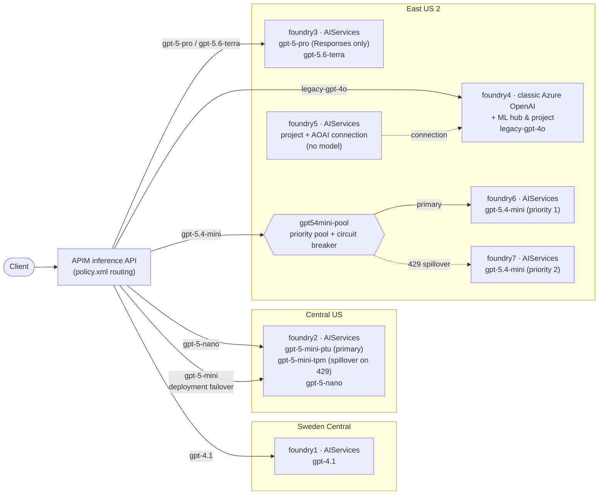

# Model routing lab

Routes inference requests through **Azure API Management** to several **Azure AI Foundry** and Azure OpenAI backends based on the requested model, and demonstrates two different spillover patterns. Everything runs from [model-routing.ipynb](model-routing.ipynb): one Bicep deployment provisions APIM, the backends, the model deployments, and the routing policy ([policy.xml](policy.xml)).

What it demonstrates:

- Model-based routing from a single APIM endpoint to backends in three regions
- Both API surfaces — Chat Completions and Responses — including a Responses-only model
- Model gating (`gpt-4o*` → `403`) with one curated exception
- A classic Azure OpenAI account coexisting with new Foundry resources, bridged by an Azure OpenAI connection
- Two spillover patterns: policy retry within one resource, and a priority backend pool across two resources
- Token metrics and diagnostics to Application Insights and Log Analytics

---

## Architecture



---

## Backends

APIM is configured with **seven backends**. Five are Foundry (`AIServices`) resources; `foundry4` is a classic Azure OpenAI account (`kind: OpenAI`) deployed alongside an Azure Machine Learning hub, project, storage account, and key vault to reproduce the legacy topology. Each backend exists to demonstrate one thing — none are redundant copies.

| Backend | Kind · region | Deployments (model · version · SKU / capacity) | Why it exists |
|---|---|---|---|
| **foundry1** | AIServices · swedencentral | `gpt-4.1` — gpt-4.1 · 2025-04-14 · GlobalStandard / 20 | Baseline single-model route |
| **foundry2** | AIServices · centralus | `gpt-5-mini-ptu` — gpt-5-mini · 2025-08-07 · GlobalStandard / **1**<br>`gpt-5-mini-tpm` — gpt-5-mini · 2025-08-07 · GlobalStandard / 20<br>`gpt-5-nano` — gpt-5-nano · 2025-08-07 · GlobalStandard / 20 | **Scenario 1** — two deployments of one model on one resource |
| **foundry3** | AIServices · eastus2 | `gpt-5-pro` — 2025-10-06 · GlobalStandard / 20<br>`gpt-5.6-terra` — 2026-07-09 · GlobalStandard / 20 | Newer models; `gpt-5-pro` is **Responses API only**, `gpt-5.6-terra` supports both surfaces |
| **foundry4** | classic Azure OpenAI · eastus2 | `legacy-gpt-4o` — gpt-4o · 2024-11-20 · GlobalStandard / 20 | Legacy hub-based topology behind the same gateway |
| **foundry5** | AIServices · eastus2 | none | Foundry project holding an **Azure OpenAI connection** to foundry4 |
| **foundry6** | AIServices · eastus2 | `gpt-5.4-mini` — 2026-03-17 · GlobalStandard / **1** | **Scenario 2** primary — pool priority 1, circuit breaker |
| **foundry7** | AIServices · eastus2 | `gpt-5.4-mini` — 2026-03-17 · GlobalStandard / 20 | **Scenario 2** spillover — pool priority 2, circuit breaker |

> The two primaries use capacity `1` to lower their quota so they return HTTP 429 sooner. Both are `GlobalStandard`, not provisioned throughput — they **simulate** a saturated PTU deployment rather than being one.

### What the foundry5 connection actually does

`foundry5` hosts no model of its own. Its project has an `AzureOpenAI` connection targeting foundry4, and its managed identity holds `Cognitive Services OpenAI User` on foundry4 — but the connection does **not** import or proxy the deployment. The notebook proves this with controls: `legacy-gpt-4o` and a deployment name that was never created return an *identical* 404 on both foundry5's resource endpoint and its project endpoint. The connection is discovery and auth metadata; inference still has to target foundry4.

---

## Routing rules (`policy.xml`)

The API is deployed as a **pass-through** API (`inferenceAPIType = "PassThrough"`), whose OpenAPI definition declares only a `/*` wildcard path. There is therefore no `{deployment-id}` route parameter, and in practice the policy resolves the requested model from the JSON body's `model` field. (`policy.xml` also reads a `deployment-id` matched parameter first; under this API definition it is always empty.)

| Requested model | Routed to | Behavior |
|---|---|---|
| `gpt-4.1` | foundry1 | Direct |
| `gpt-5-nano` | foundry2 | Direct |
| `gpt-5-mini` | foundry2 | **Deployment-level failover** — `gpt-5-mini-ptu`, retry to `gpt-5-mini-tpm` on 429 (Scenario 1) |
| `gpt-5-pro`, `gpt-5.6-terra` | foundry3 | Direct |
| `gpt-5.4-mini` | `gpt54mini-pool` | **Backend-pool failover** — foundry6 → foundry7 on 429 (Scenario 2) |
| `legacy-gpt-4o` | foundry4 | Legacy classic Azure OpenAI |
| `gpt-4o*` | — | Gated: returns `403 Forbidden` |
| anything else | — | Returns `400 Bad Request` |

---

## Spillover patterns

Both scenarios do the same thing — the primary saturates, traffic overflows to a secondary. They differ in where the failover happens.

| | Scenario 1 — one resource | Scenario 2 — two resources |
|---|---|---|
| Failover unit | Two deployments on one Foundry resource | Two Foundry resources in one pool |
| Mechanism | `<retry>` in the policy's `<backend>` section | APIM backend pool (priority-based) + per-backend circuit breaker |
| Recovers the *same* request | Yes | No — [see below](#the-request-that-trips-the-breaker-is-not-recovered) |
| Why this way | Both deployments share one endpoint, so they are one APIM backend and a pool cannot distinguish them | Distinct endpoints, so the pool works natively |
| Reusable beyond PTU→TPM | Narrow — needs two deployments on one endpoint | Broad — the same pool also does blue/green (weighted), spreading load across per-region quota, and surviving a throttled or unhealthy region |

> APIM backend pools support round-robin, weighted, and priority-based selection. There is no latency-aware or health-probe-based option — lower-priority groups are used only when every backend in the higher-priority groups has a tripped circuit breaker.

### Scenario 1 — deployment-level failover (one Foundry resource)

`gpt-5-mini` is deployed **twice on the same `foundry2` Foundry resource** with distinct deployment names: `gpt-5-mini-ptu` (mimics a saturated PTU) and `gpt-5-mini-tpm` (spillover). Because both deployments share a single endpoint, they map to one APIM backend and a native backend pool cannot tell them apart — so failover is handled **inside the APIM policy**:

1. Every `gpt-5-mini` request is sent to `gpt-5-mini-ptu` first.
2. On HTTP 429, a `<retry>` in the `<backend>` section rewrites the deployment to `gpt-5-mini-tpm` and re-sends the **same** request.
3. Both request shapes are handled: the deployment id in the **URL path** (Chat Completions) and the `model` field in the **request body** (Responses API) are rewritten to the selected deployment on each attempt.

Enabled by a `model` field in the deployment config (`name` = deployment name, `model` = underlying model) added to `modules/cognitive-services/v3/deployments.bicep`.

### Scenario 2 — backend-pool failover (two Foundry resources)

`gpt-5.4-mini` is deployed once on each of **two separate Foundry resources**, `foundry6` (priority 1) and `foundry7` (priority 2), grouped into a priority-based APIM pool (`gpt54mini-pool`). Each backend carries a circuit-breaker rule that trips on **one 429 within `PT1M`** and stays open for `PT1M`, with `acceptRetryAfter: true`. Traffic goes to `foundry6`; once its breaker opens, the pool falls through to `foundry7`.

Support comes from `backendPoolsConfig` and a per-backend `circuitBreaker` flag in `modules/apim/v3/inference-api.bicep`.

#### The request that trips the breaker is not recovered

A circuit breaker is forward-looking, and an APIM pool has no automatic same-request failover. Microsoft documents only that lower-priority groups are used *"when all backends in higher priority groups are unavailable because circuit breaker rules are tripped"* — that is, on **subsequent** requests. With the bare `<forward-request />` this lab uses:

1. Request *N* → pool → `foundry6` → **429**, which is what reaches the caller.
2. The breaker opens for `PT1M`.
3. Requests *N+1 …* skip `foundry6` and are served by `foundry7`.
4. When the trip duration expires the circuit resets and `foundry6` is tried again — costing another request if it is still saturated.

Related: when a breaker is open on a **standalone** backend (not in a pool), APIM returns `503 Service Unavailable` rather than the backend's own 429.

#### Recovering that request in production

Add a `<retry>` to the `<backend>` section. Microsoft's documented pattern names the target explicitly on each attempt rather than relying on the pool to re-select:

```xml
<backend>
    <retry condition="@(context.Response != null && context.Response.StatusCode == 429)"
           count="1" interval="1" first-fast-retry="true">
        <set-variable name="attempt" value="@(context.Variables.GetValueOrDefault<int>("attempt", 0) + 1)" />
        <set-backend-service backend-id="@((int)context.Variables["attempt"] < 2 ? "foundry6" : "foundry7")" />
        <forward-request buffer-request-body="true" />
    </retry>
</backend>
```

- `count` is the number of **retries**, so total attempts = `count + 1`.
- `interval` is required and documented as a positive number of seconds. `first-fast-retry="true"` makes the first retry immediate regardless of it.
- `buffer-request-body="true"` is what allows the body to be replayed.
- Re-forwarding to the **pool** instead of naming backends is *not* documented to pick a different pool member. It may work because the tripped backend is unavailable, but verify it before depending on it.
- Retry cannot help once response headers are flushed — a streamed (SSE) response cannot be re-issued.
- The breaker's `acceptRetryAfter: true` is not inherited by `<retry>`; honour `Retry-After` yourself for longer back-offs.

> **Retry and circuit breaker are complementary, not alternatives: retry recovers the in-flight request, the breaker protects the ones after it.** Retry alone keeps hitting a saturated backend on every call; the breaker alone sacrifices one request each time it opens or resets.

**This lab omits the retry deliberately** so the 429 stays visible in the test loop and the contrast with Scenario 1 remains observable.

---

## Observability

- **`x-ms-region`** reveals the Azure **region** that served a request. That distinguishes foundry1 / foundry2 / foundry3, but *not* foundry6 from foundry7 — both are in East US 2.
- **`azure-openai-emit-token-metric`** sends token usage to Application Insights, dimensioned by subscription, client IP, API, and requested model.
- **APIM diagnostics** stream to Log Analytics, logging `x-ms-region`, `x-ratelimit-remaining-tokens`, and `x-ratelimit-remaining-requests`.
- **`AllMetrics`** is enabled on the five `AIServices` resources (foundry1/2/3/6/7). foundry4 and foundry5 have no diagnostic settings.

---

## Run the lab

Open [model-routing.ipynb](model-routing.ipynb) and run the cells top to bottom (or **Run All**):

1. **Initialize** notebook variables (regions, models, pools).
2. **Verify** the Azure CLI / subscription.
3. **Deploy** the Bicep template ([main.bicep](main.bicep)) with the generated [params.json](params.json).
4. **Get outputs** (APIM gateway URL + subscription key).
5. **Test** both surfaces. The Chat Completions loop covers `gpt-4.1`, `gpt-5-mini`, `gpt-5-nano`, `gpt-5.4-mini`, `gpt-5.6-terra`, `legacy-gpt-4o`; the Responses loop swaps `legacy-gpt-4o` for `gpt-5-pro`. Watch the returned model and `x-ms-region` to observe routing and spillover.

### Prerequisites

- Python 3.12+, VS Code with the Jupyter extension, and [uv](https://docs.astral.sh/uv/) (`uv sync` from the repo root).
- An Azure subscription with Contributor + RBAC Administrator (or Owner).
- Azure CLI, signed in.

### Clean up

When finished, remove all deployed resources with the [clean-up-resources notebook](clean-up-resources.ipynb) to avoid charges.
