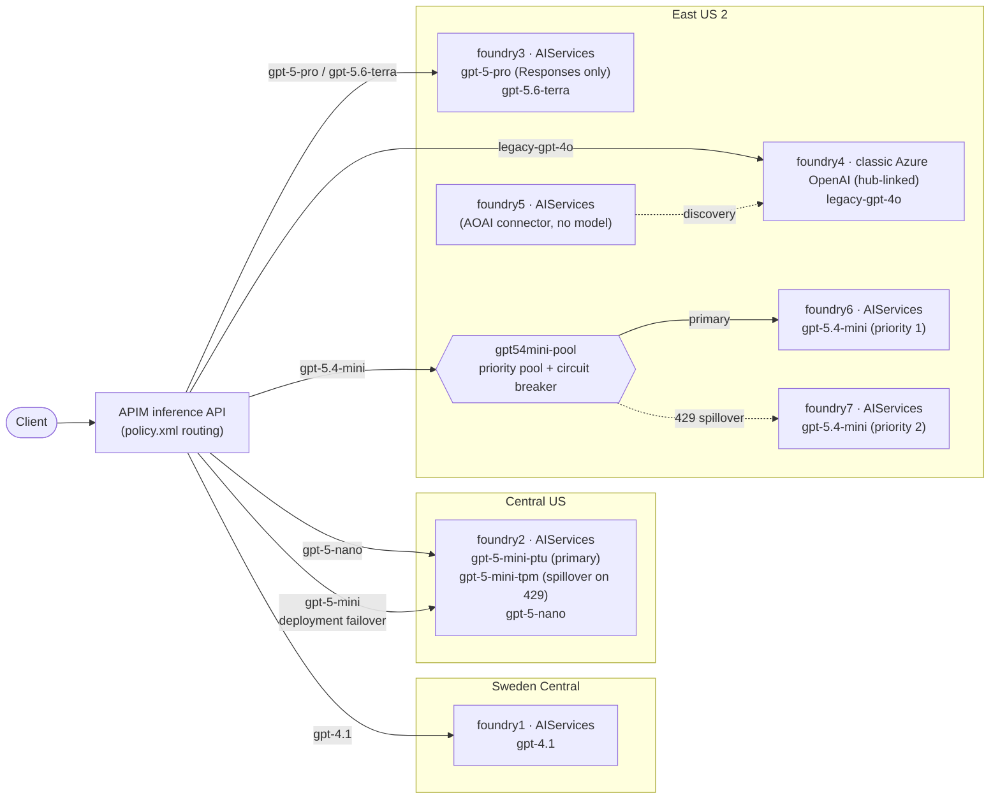

# Model routing lab

A playground for routing inference requests through **Azure API Management (APIM)** to different **Azure AI Foundry** backends based on the requested model. It runs entirely from [model-routing.ipynb](model-routing.ipynb) — one Bicep deployment provisions APIM, the Foundry resources, model deployments, and the routing policy ([policy.xml](policy.xml)).

The lab has grown beyond simple model→region routing to also demonstrate **two different load‑balancing / failover patterns** that mimic a PTU‑primary → TPM‑spillover topology without provisioning a PTU deployment.

---

## Architecture

---

## Why seven Foundry resources?

Each Foundry resource exists to demonstrate one specific pattern — they are **not** redundant copies.

| Resource | Exists to demonstrate |
|---|---|
| **foundry1** | Baseline — plain single-region, single-model backend (`gpt-4.1`, Sweden Central) |
| **foundry2** | **Scenario 1** — PTU→TPM spillover *within one resource* (two deployments of `gpt-5-mini`), plus `gpt-5-nano` |
| **foundry3** | Newer / preview models on a separate resource, including a **Responses-API-only** model (`gpt-5-pro`, `gpt-5.6-terra`) |
| **foundry4** | **Legacy** classic Azure OpenAI account (hub-linked) hosting `legacy-gpt-4o` |
| **foundry5** | **New Foundry resource + project** reaching foundry4 through an **AOAI connector** (control-plane discovery; hosts no model of its own) |
| **foundry6** | **Scenario 2** primary — priority 1 in the native APIM backend pool, circuit breaker on |
| **foundry7** | **Scenario 2** spillover — priority 2 in the same pool, circuit breaker on |

Grouped by scenario:

- **Catalog / multi-region routing** → foundry1, foundry3
- **PTU→TPM spillover inside one resource (policy retry)** → foundry2
- **Legacy AOAI coexistence + AOAI connector bridge** → foundry4 + foundry5
- **Priority pool + circuit-breaker failover across resources** → foundry6 + foundry7

---

## Backends & deployments

| Backend | Kind | Region | Deployment | Model | Version | SKU / Capacity | Notes |
|---|---|---|---|---|---|---|---|
| **foundry1** | AIServices | swedencentral | `gpt-4.1` | gpt-4.1 | 2025-04-14 | GlobalStandard / 20 | General purpose |
| **foundry2** | AIServices | centralus | `gpt-5-mini-ptu` | gpt-5-mini | 2025-08-07 | GlobalStandard / **1** | Scenario 1 primary (low capacity → 429s) |
| **foundry2** | AIServices | centralus | `gpt-5-mini-tpm` | gpt-5-mini | 2025-08-07 | GlobalStandard / 20 | Scenario 1 spillover |
| **foundry2** | AIServices | centralus | `gpt-5-nano` | gpt-5-nano | 2025-08-07 | GlobalStandard / 20 | Efficient reasoning |
| **foundry3** | AIServices | eastus2 | `gpt-5-pro` | gpt-5-pro | 2025-10-06 | GlobalStandard / 20 | **Responses API only** |
| **foundry3** | AIServices | eastus2 | `gpt-5.6-terra` | gpt-5.6-terra | 2026-07-09 | GlobalStandard / 20 | Flagship reasoning |
| **foundry6** | AIServices | eastus2 | `gpt-5.4-mini` | gpt-5.4-mini | 2026-03-17 | GlobalStandard / **1** (priority 1) | Scenario 2 primary + circuit breaker |
| **foundry7** | AIServices | eastus2 | `gpt-5.4-mini` | gpt-5.4-mini | 2026-03-17 | GlobalStandard / 20 (priority 2) | Scenario 2 spillover + circuit breaker |
| **foundry4** | OpenAI (classic, hub-linked) | eastus2 | `legacy-gpt-4o` | gpt-4o | 2024-11-20 | GlobalStandard / 20 | Legacy topology |
| **foundry5** | AIServices | eastus2 | — | — | — | — | AOAI connector to foundry4 (control-plane discovery only, no model) |

> Primary capacities are intentionally set to `1` so they saturate and return HTTP 429 quickly, making the spillover easy to observe in the test loops.

---

## Routing rules (`policy.xml`)

The policy resolves the requested model from the `deployment-id` route parameter or the JSON body `model` field, then routes:

| Requested model | Routed to | Behavior |
|---|---|---|
| `gpt-4.1` | foundry1 | Direct |
| `gpt-5-nano` | foundry2 | Direct |
| `gpt-5-mini` | foundry2 | **Deployment-level failover** — `gpt-5-mini-ptu`, retry to `gpt-5-mini-tpm` on 429 (Scenario 1) |
| `gpt-5-pro`, `gpt-5.6-terra` | foundry3 | Direct |
| `gpt-5.4-mini` | `gpt54mini-pool` | **Backend-pool failover** — foundry6 → foundry7 on 429 (Scenario 2) |
| `legacy-gpt-4o` | foundry4 | Legacy classic Azure OpenAI |
| `gpt-4o*` | — | Gated: returns `403 Forbidden` |
| anything else | — | Returns `400 Bad Request` |

---

## Load-balancing setups

### Scenario 1 — deployment-level failover (one Foundry resource)

`gpt-5-mini` is deployed **twice on the same `foundry2` Foundry resource** with distinct deployment names: `gpt-5-mini-ptu` (mimics a saturated PTU) and `gpt-5-mini-tpm` (spillover). Because both deployments share a single endpoint, they map to one APIM backend and a native backend pool cannot tell them apart — so failover is handled **inside the APIM policy**:

1. Every `gpt-5-mini` request is sent to `gpt-5-mini-ptu` first.
2. On HTTP 429, a `<retry>` in the `<backend>` section rewrites the deployment to `gpt-5-mini-tpm` and re-sends the **same** request.
3. Both request shapes are handled: the deployment id in the **URL path** (Chat Completions) and the `model` field in the **request body** (Responses API) are rewritten to the selected deployment on each attempt.

Enabled by a `model` field in the deployment config (`name` = deployment name, `model` = underlying model) added to `modules/cognitive-services/v3/deployments.bicep`.

### Scenario 2 — backend-pool failover (two Foundry resources)

`gpt-5.4-mini` is deployed once on each of **two separate Foundry resources**, `foundry6` (priority 1) and `foundry7` (priority 2), grouped into a native APIM **priority pool** (`gpt54mini-pool`). Each backend has a **circuit breaker** that trips on a 429 for `PT1M`:

1. The pool sends traffic to the priority-1 backend (`foundry6`).
2. When `foundry6` returns 429, its circuit breaker opens and the pool routes to the priority-2 backend (`foundry7`).

This is the idiomatic **PTU-primary → PayGo-spillover** pattern and requires no custom retry policy. Support added via `backendPoolsConfig` and a per-backend `circuitBreaker` flag in `modules/apim/v3/inference-api.bicep`.

> **Behavioral difference:** Scenario 1 fails over the *same* request (explicit retry). Scenario 2 trips the primary on a 429 and routes *subsequent* requests to the secondary — so in the test loop the spillover appears on calls after the first 429, which is standard circuit-breaker behavior.

---

## Use cases covered

This lab is designed to demonstrate the following, end to end:

1. **Model-based routing** — route a single APIM endpoint to different Foundry backends based on the requested model / deployment id.
2. **Multi-region backends** — deployments spread across Sweden Central, Central US, and East US 2.
3. **Dual API surface** — the same routed models exercised through both the **Chat Completions** and the **Responses API**.
4. **Responses-API-only models** — `gpt-5-pro` is routed and tested only through the Responses API (it does not support Chat Completions).
5. **Model access control / gating** — any `gpt-4o*` variant is blocked with `403`, while a curated `legacy-gpt-4o` route remains allowed.
6. **Legacy topology coexistence** — a classic, hub-linked Azure OpenAI account (`foundry4`) surfaced through the same APIM endpoint, plus a new AIServices Foundry (`foundry5`) connected to it via an AOAI connector for control-plane discovery.
7. **PTU/TPM spillover — deployment level (Scenario 1)** — two deployments of one model on a single Foundry resource, with policy-driven retry/failover on 429.
8. **PTU/TPM spillover — backend-pool level (Scenario 2)** — one model across two Foundry resources, load balanced by a native priority pool + circuit breaker.
9. **Observability** — the `x-ms-region` response header reveals which backend served each request; APIM streams diagnostics and an `azure-openai-emit-token-metric` policy (token usage) to Application Insights, and every Foundry resource emits `AllMetrics` to the Log Analytics workspace.

---

## Run the lab

Open [model-routing.ipynb](model-routing.ipynb) and run the cells top to bottom (or **Run All**):

1. **Initialize** notebook variables (regions, models, pools).
2. **Verify** the Azure CLI / subscription.
3. **Deploy** the Bicep template ([main.bicep](main.bicep)) with the generated [params.json](params.json).
4. **Get outputs** (APIM gateway URL + subscription key).
5. **Test** Chat Completions and the Responses API; watch the `x-ms-region` header and the routed model to observe routing and spillover.

### Prerequisites

- Python 3.12+, VS Code with the Jupyter extension, and [uv](https://docs.astral.sh/uv/) (`uv sync` from the repo root).
- An Azure subscription with Contributor + RBAC Administrator (or Owner).
- Azure CLI, signed in.

### Clean up

When finished, remove all deployed resources with the [clean-up-resources notebook](clean-up-resources.ipynb) to avoid charges.
